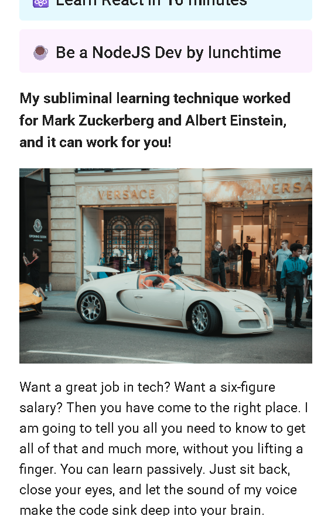
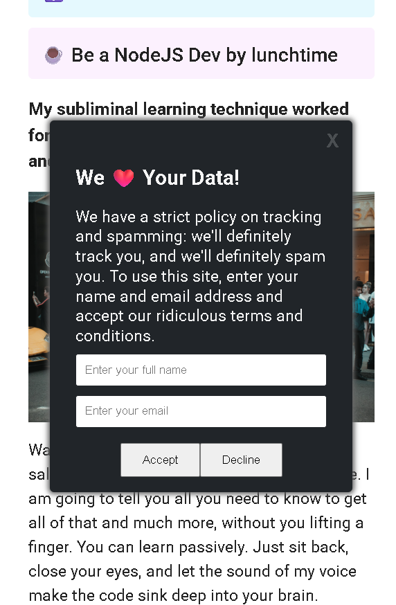
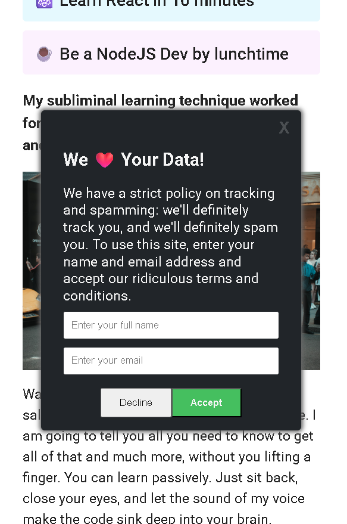
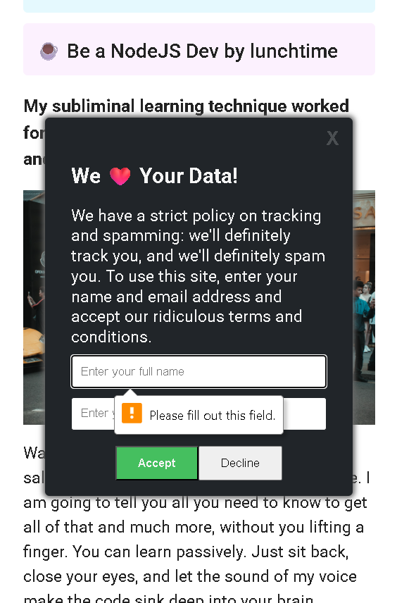
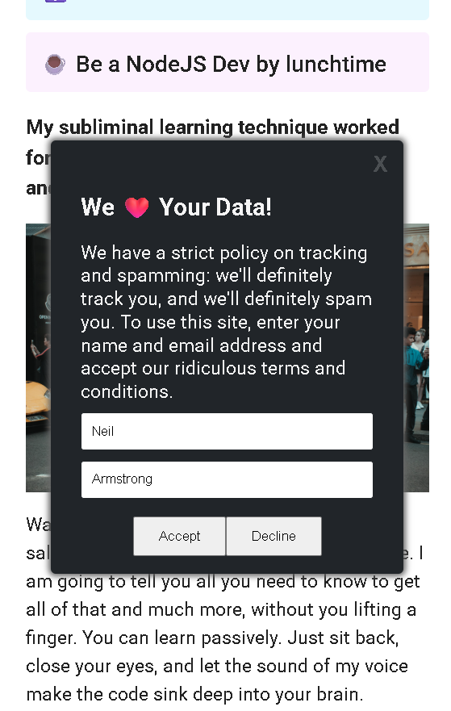
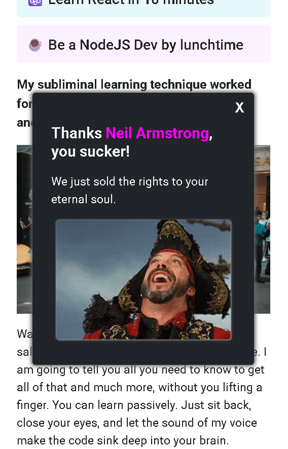

# 🍪 Cheeky Cookie Consent Popup

A fun and slightly mischievous **cookie consent popup project** built with **HTML, CSS, and JavaScript**, designed to practice advanced DOM manipulation and event handling.

This project simulates a playful (and sarcastic 😈) user experience where the popup *forces interaction*, collects user input, and responds dynamically.

---

## 🚀 Features

* ⏳ **Delayed Popup Appearance** using `setTimeout`
* 🚫 **Disabled Close Button** (forces user interaction)
* 🔁 **Button Swap Effect** using `classList.toggle()` with CSS `row-reverse`
* 📝 **Form Handling** with `event.preventDefault()`
* 📦 **User Data Capture** using `FormData` and `.get()`
* ⌛ **Sequential Loading Simulation** with multiple `setTimeout`
* 😂 **Dynamic Personalized Message** after submission
* ✅ **Close Button Enabled After Interaction**
* 🎭 **Humorous UI/UX Experience**

---

## 📸 Screenshots

### Popup Appears



### Initial Form



### Button Interaction (Swapped)



### Validation Message



### User Input Filled



### Final Message



---

## 🧠 What I Learned

* Deep understanding of **DOM Manipulation**
* Handling **user events** effectively
* Working with **forms & validation**
* Managing **async behavior** using `setTimeout`
* Dynamically updating UI using **innerHTML**
* Creating engaging (and fun) user experiences

---

## 📂 Project Structure

```
📦 Cheeky-Cookie-Popup
 ┣ 📂 images
 ┃ ┣ bugatti.jpg
 ┃ ┣ loading.svg
 ┃ ┗ pirate.gif
 ┣ 📂 screenshots
 ┃ ┣ Screenshot-1.png
 ┃ ┣ Screenshot-2.png
 ┃ ┣ Screenshot-3.png
 ┃ ┣ Screenshot-4.png
 ┃ ┣ Screenshot-5.png
 ┃ ┗ Screenshot-6.png
 ┣ index.html
 ┣ index.css
 ┣ index.js
```

---

## 🛠️ Tech Stack

* HTML5
* CSS3
* JavaScript (Vanilla JS)
* Vite

---

## 📚 Learning Resource

This project is part of my learning journey with **Scrimba** 👇
[https://scrimba.com/?via=u43a7734](https://scrimba.com/?via=u43a7734)

---

## 👨‍💻 Author

**Fakhar Alam**
Full Stack AI Web Developer

🔗 LinkedIn:
[https://www.linkedin.com/in/fakhar-e-alam-a046133b4/?skipRedirect=true](https://www.linkedin.com/in/fakhar-e-alam-a046133b4/?skipRedirect=true)

---
